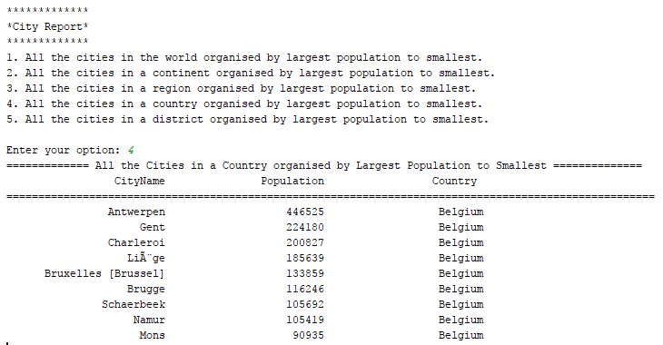
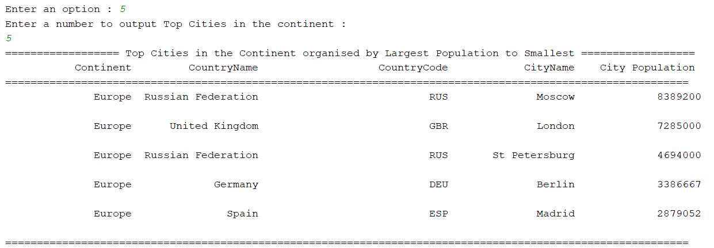
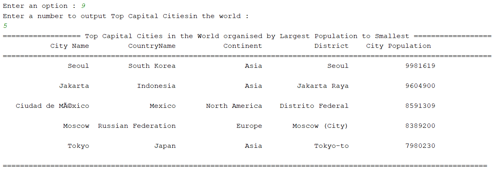
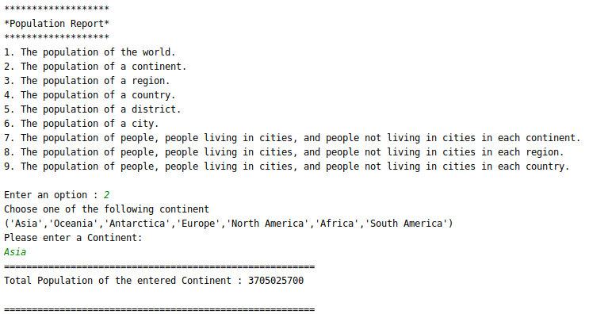

# DevOps Group3
<!DOCTYPE html>
<html>
<head></head>
<body>
<table>
  <tr>
    <th>Group-3 Members</th>
    <th>ID</th>
    <th>Role</th>
  </tr>
  <tr>
    <td>Ein Gyin Moe</td>
    <td>40414316</td>
    <td>Scrum Master</td>
  </tr>
   <tr>
    <td>Khin Shoon Lett Moe</td>
    <td>40414299</td>
    <td>Product Owner</td>
  </tr>
   <tr>
    <td>Nang Cherry Moe Myint</td>
    <td>40414295</td>
    <td>Developer</td>
  </tr>
   <tr>
    <td>Khin Myat Nwe</td>
    <td>40414304</td>
    <td>Developer</td>
    </tr> </table>
 
</body>
</html>

- Master Build Status 
- Develop Build Status 
- License 
- Release 
- Code Coverage 

# Report 
| No. | Task Name | Done | Screenshot |
| --- | --- | --- | --- |
| 1 | All the countries in the world organised by largest population to smallest. | Yes |  |
| 2 | All the countries in a continent organised by largest population to smallest. | Yes |  |
| 3 | All the countries in a region organised by largest population to smallest. | Yes |  |
| 4 | The top N populated countries in the world where N is provided by the user. | Yes|  |
| 5 | The top N populated countries in a continent where N is provided by the user. | Yes |  |
| 6 | The top N populated countries in a region where N is provided by the user. | Yes |  |
| 7 | All the cities in the world organised by largest population to smallest. | Yes |  |
| 8 | All the cities in a continent organised by largest population to smallest. | Yes |  |
| 9 | All the cities in a region organised by largest population to smallest. | Yes |  |
| 10 | All the cities in a country organised by largest population to smallest. | Yes |  |
| 11 | All the cities in a district organised by largest population to smallest. | Yes |  |
| 12 | The top N populated cities in the world where N is provided by the user. | Yes |  |
| 13 | The top N populated cities in a continent where N is provided by the user. | Yes |  |
| 14 | The top N populated cities in a region where N is provided by the user. | Yes |  |
| 15 | The top N populated cities in a country where N is provided by the user. | Yes |  |
| 16 | The top N populated cities in a district where N is provided by the user. | Yes |  |
| 17 | All the capital cities in the world organised by largest population to smallest. | Yes |  |
| 18 | All the capital cities in a continent organised by largest population to smallest. | Yes |  |
| 19 | All the capital cities in a region organised by largest to smallest. | Yes |  |
| 20 | The top N populated capital cities in the world where N is provided by the user. | Yes|  |
| 21 | The top N populated capital cities in a continent where N is provided by the user. | Yes|  |
| 22 | The top N populated capital cities in a region where N is provided by the user. | Yes |  |
| 23 | The population of people, people living in cities, and people not living in cities in each continent. | Yes |  |
| 24 | The population of people, people living in cities, and people not living in cities in each region. | Yes |  |
| 25 | The population of people, people living in cities, and people not living in cities in each country. | Yes |  |
| 26 | The population of the world. | Yes |  |
| 27 | The population of a continent. | Yes |  |
| 28 | The population of a region. | Yes |  |
| 29 | The population of a country. | Yes |  |
| 30 | The population of a district. | Yes |  |
| 31 | The population of a city. | Yes |  |
| 32 | The number of people who speak the Chinese/English/Hindi/Spanish/Arabic languages from greatest number to smallest, including the percentage of the world population. | Yes |  |

# Team Contribution Report 
|      | Code Review 1 | Code Review 2 | Code Review 3 | Code Review 4 | Final Deliverable | Average |
|------|---------------|---------------|---------------|---------------|-------------------|-------|
| Ein Gyin Moe | 0.25 | 0.28 | 0.25 | 0.26 | 0.26 | 0.26 |
| Khin Shoon Lett Moe | 0.25| 0.24 | 0.25 | 0.26 | 0.3 | 0.27 |
| Nang Cherry Moe Myint | 0.25 | 0.24| 0.25 | 0.23 | 0.21 | 0.23 |
| Khin Myat Nwe | 0.25 | 0.24 | 0.25 | 0.25 | 0.23 | 0.24 |
